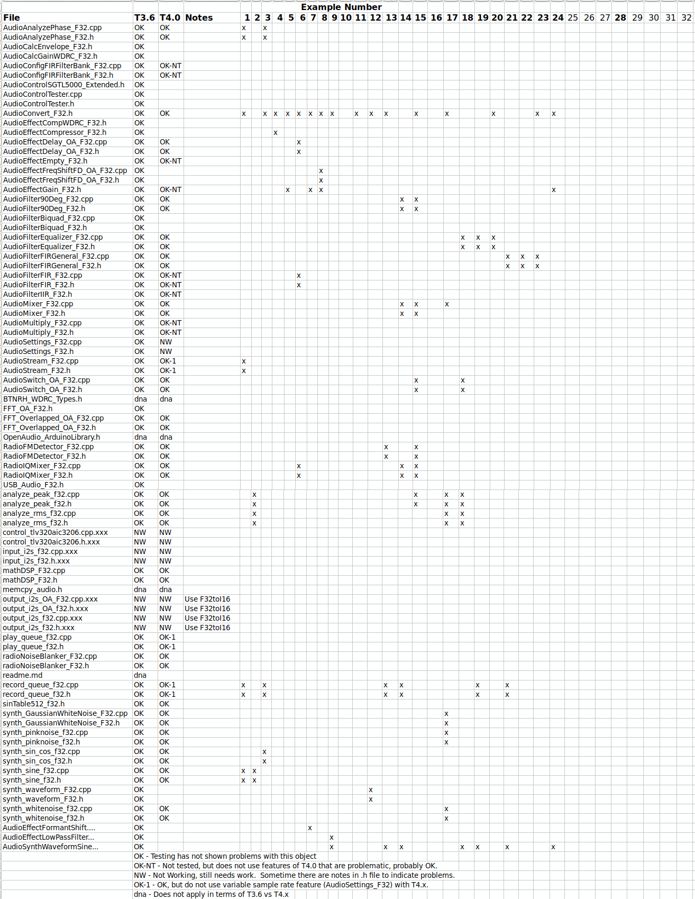

OpenAudio Library for Teensy
===========================

**Special Note**  17 June 2020 - This library is undergoing revision to make Teensy 4.x compatible and to add functionality.  Changes are expected throughout the rest of June.  See this readme for summaries during this period.  Notes details are at the bottom of this page.

**Special Note 2***  2 July 2020 - Recently, the input and output I2S for F32 have been disabled as they had major hardware problems with
Teensy 4.x.  The previous output_i2s_f32 files supported variable sample rate and variable block size, but only
for T3.x. To get this going again, the old classes will be re-enabled for T3.x only .  And, new classes have been
created that compile and run under T4.x (and T3.5, T3.6) but, for now, have no provision for changing block size, sample rate or ADC
output word (always 16-bit).  The new files are output_i2s_OA_F32.h and output_i2s_OA_F32.cpp with the corresponding inputs to come soon. The classes are AudioInputI2S_OA_F32 and AudioOutputI2S_OA_F32 with the same functionality as their parallel 16-bit
integer classes under Teensy Audio.  If you need variable block size and/or variable data rate (T3.x only) use the Convert_I16toF32 and
Convert_F32toU16 classes.

**Purpose**: The purpose of this library is to build upon the [Teensy Audio Library](http://www.pjrc.com/teensy/td_libs_Audio.html) to enable new functionality for real-time audio processing.

**Approach**: I am attempting to follow the structure and approach of the Teensy Audio Library so that coding techniques, style, and structure that works for the Teensy Audio Library will also work with my library.  synth_sine_f32

**Send Help!**:  While I'm hoping to follow the pattern of the Teensy Audio Library, I am not a well trained programmer, so I have difficulty chosing the right path.  If you see ways to make my code better aligned with the Teensy Audio Library, send a pull request!

Contents
---------

As I said, the goal of this library is to extend the functionality of the Teensy Audio Library.  My extensions are focused in these areas:

**Floating Point Audio Processing**:  The Teensy Audio Library processes the audio data as fixed-point Int16 values.  While very fast for the Teensy 3.0-3.2, it is unnecessarily constraining (IMO) for the Teensy 3.5 and 3.6, which both have floating-point units.  To enable floating-point audio processing, I have created:
* **AudioStream_F32: Following the model of Teensy's `AudioStream` class.  In addition to the new `AudioStream_F32`, this file includes a new `audio_block_f32_t` in place of `audio_block_t`, as well as a new `AudioConnection_F32` in place of `AudioConnection`.
* **New F32 Audio Processing Blocks**: Using this new floating-point capability, I've written some new audio processing blocks that operate using floating-point audio values instead of fixed-point values.  Examples include `AudioEffectGain_F32` and `AudioEffectComperessor_F32`.
* **F32 Versions of Existing Blocks**: To maintain continuity with the Teensy Audio Library, a number of the Audio Library's Audio blocks (which process as Int16 data) to operate on floating-point (ie, Float32) data.  Thanks to other people's contributions, examples include `AudioMixer4_F32` and `AudioMultiply_F32`.  Feel free to convert more blocks, if you'd like!
* **New Hardware Controls**: The Teensy Audio Library does a great job of wrapping up the complicated control of hardware elements (such as the SGTL5000 audio codec) into a nice easy-to-use classes.  But, sometimes, certain features of the hardware were not exposed in those classes.  Here, I've extended the default classes to expose the extra features that I want.  See `AudioControlSGTL5000_Extended` as an example.

After installing this library into your Arduino->Libraries direction, you can have access to any of these capabilities simply by including the following command in your Arduino sketch: `#include <OpenAudio_ArduinoLibrary.h>`.

Installation
------------

Download (and unzip) this library into the Arduino libraries directory on your computer.  On my computer, that means I put it here:

`C:\Users\chipaudette\Documents\Arduino\libraries\OpenAudio_ArduinoLibrary`

Restart your Arduino IDE and you should now see this libraries example sketches under File->Examples->OpenAudio_ArduinoLibrary

Dependencies
------------

This library extends the functionality of the [Teensy Audio Library](http://www.pjrc.com/teensy/td_libs_Audio.html), so you'll need to install it per its instructions.

The floating-point processing takes advantage of the DSP acceleration afforded by the ARM M4F core inside the Teensy 3.5/3.6 processor.  Therefore, it uses `arm_math.h`.  This dependencies is installed automatically when you install the Teensy Audio Library, so you don't need to take any extra steps.  It's there already.

Status
------

The following table summarizes the status, as of 24 November 2020.  I will try to keep this up-to-date as work continues, but tere will be lags.
Thus there may be more T4.x compatibility than shown here.  A blank entry for status does not indicate a problem, but rather a lack
of verification.  Further examples will come to test some of these objects.

The example files (from the Examples directory) are

1.   AudioTestAnalyzePhase_F32
2.   AudioTestPeakRMS
3.   AudioTestSinCos
4.   BasicCompressor_Float
5.   BasicGain_Float
6.   FineFreqShift_OA
7.   FormantShifter_FD_OA
8.   FrequencyShifter_FD_OA
9.   LowpassFilter_FD_OA
10.  MixStereoToMono_Float
11.  MyAudioEffect_Float
12.  OscillatorWithPitchmod_Float
13.  ReceiverFM
14.  ReceiverPart1
15.  ReceiverPart2
16.  Repair audio mixer_F32
17.  SignalNoise_float
18.  Switches_float
19.  TestEqualizer1
20.  TestEqualizer1Audio
21.  TestFIRGeneral3
22.  TestFIRGeneralLarge4
23.  TestFIRGeneralLarge5
24.  TestInputOutput_float

28.  Tympan_TLV320AIC3206

WORKING NOTES - For now, here are some temporary notes:
---------------
1.  synth_sine_f32.h & .cpp allowed both KINETISK and__IMXRT1062__ to support T4.x.  Tested 3.6, 4.0
2.  Fix synth_pinknoise_f32.h & .cpp built in I16 to F32. Now T3 and T4.
3.  Fix synth_whitenoise_f32.cpp to include IMXRT1062  and built in I16 to F32. Now T3 and T4.
4.  Added Gaussian White Noise F32. This is T3 and T4.
5.  Renamed 3206 codec to .xxx to stop collisions with Teensy I16 library. Needs work. 
6.  Added new examples/SignalNoise_float.ino to test white, pink, Gaussian noise and sine. Audio out. 
7.  Disabled output_i2s_f32.h, .cpp by .xxxfile type. These need rework for T4. Use Convert_F32toI16. 
8.  Disabled control_tlv320aic3206.h, .cpp by .xxxfile type. These collide with Teensy I16 Audio. 
9.  Added new analyze_peak_f32.h and .cpp that parallel similar classes in the Teensy I16 library. 
10.  Added new analyze_rms_f32.h and .cpp that parallel similar classes in the Teensy I16 library. 
11.  Moved AudioSwitch_F32 from Tympan, added 8-channel version. 
12.  Added /examples/Switches_float.ino for 4 and 8 channel switches. 
13.  Moved FFT_Overlapped_F32 files from Tympan, revised for T4.0, added _OA name isolation. 
14.  Moved Overlapped FFT LPF .INO from Tympan to OA.  Working T3.6 and T4.0 
15.  Moved Overlapped FFT AudioFormantShifter INO and related from Tympan to _OA Open Audio. Tested 3.6 and 4.0.
16.  Moved AudioFrequencyShifter INO and related from Tympan to _OA Open Audio. Tested 3.6 and 4.0.
17.  Working on SdFatWriter and related SdFat files.  DO NOT USE.
18.  Modified AudioEffectDelay for T4.0.
19.  Moved in radio function AudioFilter90Deg_F32.
20.  Moved in radio function RadioIQMixer_F32.
21.  Added Example INO, FineFreqShift_OA.ino with Hilbert shifter and delay stereo.
22.  Brought in support stuff mathDSP_F32 and sinTable512_F32.h.
23.  Brought in AudioAnalyzePhase_F32 and Example
24.  Brought in AudioFilterEqualyzer_F32 and 2 Example
25.  Brought in AudioFilterFIRGeneral_F32 and 2 Example INOs
26.  Brought in RadioFMDetector_F32 and Example
27.  Brought in synth_sin_cos_F32 and test example
28.  Brought in RadioNoiseBlanker_F32 and Example
29.  Created output_i2s_OA_F32.h and .cpp to have F32 input.  Work in Progress, DO NOT USE. Set to .xxx
30.  Repaired Audio Mixers 4 & 8.  These are adders, NOT RF DBM's---see Multiplier_F32.
